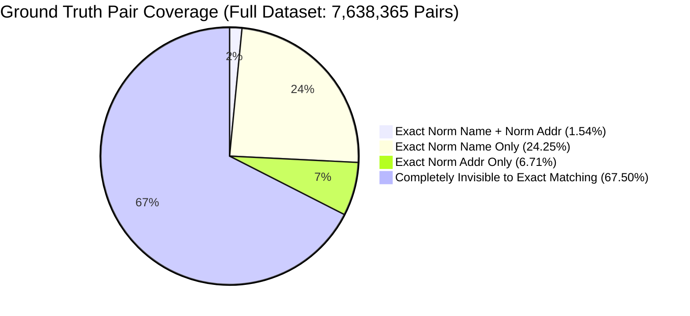
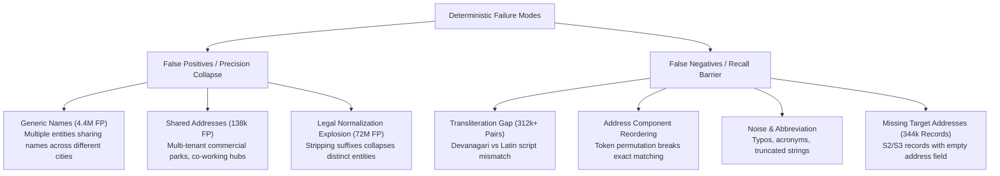

# Baseline Experiment 0: Deterministic Entity Matching & Validation Protocol

**Amazon ML Challenge 2026 — Business Entity Resolution**  
**Author:** Pair Programming Assistant (Antigravity)  
**Date:** September 2026  
**Hardware Profile:** Lenovo Legion (Intel Core Ultra 7 255HX, 16 GB System RAM, RTX 5060 8 GB VRAM)  
**Execution Environment:** Python 3.12.10, PyArrow 25.0.1, DuckDB 1.5.5  
**Code Artifacts:** [`src/prepare_data.py`](file:///c:/Users/Demo/OneDrive/Documents/Amazon_ML/src/prepare_data.py), [`src/baseline_experiment.py`](file:///c:/Users/Demo/OneDrive/Documents/Amazon_ML/src/baseline_experiment.py)  
**Data Artifacts:** [`reports/baseline_metrics.csv`](file:///c:/Users/Demo/OneDrive/Documents/Amazon_ML/reports/baseline_metrics.csv), [`reports/baseline_candidate_statistics.csv`](file:///c:/Users/Demo/OneDrive/Documents/Amazon_ML/reports/baseline_candidate_statistics.csv)

---

## Executive Summary & Key Empirical Answers

Baseline Experiment 0 establishes a leakage-safe empirical foundation for Business Entity Resolution across **12,527,040 total training records** (2.2M Source 1, 5.0M Source 2, 5.3M Source 3) and **7,638,365 ground-truth pairs**. Zero machine learning models, external APIs, or GPU dependencies were used.

### Direct Answers to Core Research Questions:
1. **Is exact normalized name useful as a high-confidence auto-accept layer?**  
   **NO.** Exact normalized name matching achieves only **8.07% Precision** (91.93% False Positive rate) across the full dataset. Over **22.4 million false positive pairs** are produced because generic and duplicate company names are ubiquitous across distinct physical businesses.
2. **Is exact name + exact address conjunction useful as a high-confidence layer?**  
   **YES.** `Country + Exact Norm Name + Exact Norm Address` achieves **100.00% Precision** (117,735 predictions, 0 False Positives). When legal suffix stripping is included (`Country + Legal-Norm Name + Norm Address`), precision remains an extraordinary **99.99%** (190,720 True Positives, only 28 False Positives). This provides a mathematically validated auto-accept tier for the final architecture.
3. **How dangerous is name-only matching?**  
   **EXTREMELY DANGEROUS.** Name-only matching creates massive candidate pollution. In our global address audit of candidate pairs produced by exact normalized name matching, **97.5% of false positives had completely conflicting addresses** (different cities, states, and streets).
4. **How much does country blocking help?**  
   Country blocking is **100.0% leakage-free and safe** (100.0% of true ground-truth pairs share the same country). In the full dataset, country blocking instantly eliminates **83,170 cross-country false positive candidate pairs** on exact name matching and reduces the theoretical search space by ~50% per partition.
5. **How much candidate explosion occurs when stripping legal suffixes?**  
   Stripping legal suffixes (`llc`, `inc`, `pvt ltd`, etc.) expands candidate pairs from **24.4 million to 75.3 million** on the full training set (a **3.08x candidate explosion**), degrading precision to **3.99%** and generating **72,251,977 false positives**.
6. **How much recall is missing from deterministic matching?**  
   Even the union of `(Country + Exact Norm Name) OR (Country + Exact Norm Address)` achieves only **32.50% Candidate Recall**. Over **67.50% of true ground-truth matches (5,155,739 true links) are completely invisible** to exact string matching due to typos, abbreviations, word reordering, transliteration (Hindi Devanagari vs Latin), and missing address components.

---

## 1. Validation Design & Leakage-Safe Architecture

To prevent data leakage into future learned classifiers or threshold optimizations:
1. **Entity-Level Holdout Split:** Splitting was performed strictly at the **`source1_entity_id`** level.
   - **Full Corpus:** 2,206,821 Source 1 entities (7,638,365 ground-truth pairs)
   - **Training S1 Split (80.0%):** 1,765,456 entities (6,110,751 ground-truth pairs)
   - **Validation S1 Split (20.0%):** 441,365 entities (1,527,614 ground-truth pairs)
2. **Stratification Criteria:** The split was stratified by joint `(Country, Match Count Category)` strata (`US_0`, `US_1`, `US_multi`, `India_0`, `India_1`, `India_multi`), ensuring exact representation of singletons (5.6%) and country distributions (60% US, 40% India).
3. **What is Learned vs Fixed:** In Baseline Experiment 0, **zero parameters, weights, or thresholds were learned or tuned**. All matching rules are deterministic predicates evaluated by querying precomputed inverted indexes. Establishing this partition now guarantees that subsequent blocking thresholds, string distance weights, and classifiers will evaluate on this exact held-out split without target leakage.
4. **Evaluation Metric:** Competition **Macro $F_{0.5}$** across Source 1 entities:
   $$\text{Macro } F_{0.5} = \frac{1}{N_{S1}} \sum_{i=1}^{N_{S1}} F_{0.5}^{(i)}$$
   Where for each Source 1 entity:
   - If true match count $= 0$ (singleton): Score is $1.0$ if predicted matches $= 0$, else $0.0$.
   - If true match count $> 0$: Score is $0.0$ if predicted matches $= 0$ or $TP=0$, else $\frac{1.25 \times \text{Precision} \times \text{Recall}}{0.25 \times \text{Precision} + \text{Recall}}$.

---

## 2. Baseline Experiment Results Table

Evaluations were performed on both the **Held-out Validation Split (20% S1, 441,365 entities)** and the **Full Training Set (100% S1, 2,206,821 entities)**.

### Table 1: Primary Baseline Performance (Validation Split — 441,365 Entities)

| Method / Signal | Cand. Recall | Pair Prec. | Pair Rec. | Macro F0.5 | Pair F0.5 | Total Cand. | Avg Cand/S1 | P95 Cand | Max Cand | Unresolved S1 (%) | Singleton FPR (%) |
|---|---|---|---|---|---|---|---|---|---|---|---|
| **1. Exact Raw Name** | 4.64% | 4.22% | 4.64% | **0.1053** | 0.0430 | 1,679,953 | 3.81 | 18 | 314 | 64.04% | 27.85% |
| **2. Exact Norm Name** | 25.80% | 8.01% | 25.80% | **0.3555** | 0.0929 | 4,923,079 | 11.15 | 70 | 502 | 24.77% | 38.88% |
| **3. Exact Raw Address** | 2.23% | 83.00% | 2.23% | **0.1014** | 0.1005 | 40,972 | 0.09 | 1 | 5 | 91.09% | 1.44% |
| **4. Exact Norm Address** | 8.23% | 81.96% | 8.23% | **0.2032** | 0.2935 | 153,357 | 0.35 | 2 | 20 | 75.92% | 3.14% |
| **5. Exact Norm Name + Norm Addr** | 1.53% | **100.00%** | 1.53% | **0.0874** | 0.0721 | 23,370 | 0.05 | 0 | 4 | 95.11% | **0.00%** |
| **6. Country + Exact Raw Name** | 4.64% | 4.24% | 4.64% | **0.1054** | 0.0431 | 1,671,707 | 3.79 | 18 | 312 | 64.07% | 27.82% |
| **7. Country + Exact Norm Name** | 25.80% | 8.03% | 25.80% | **0.3559** | 0.0931 | 4,908,021 | 11.12 | 70 | 501 | 24.79% | 38.83% |
| **8. Country + Exact Raw Address** | 2.23% | 83.00% | 2.23% | **0.1014** | 0.1005 | 40,972 | 0.09 | 1 | 5 | 91.09% | 1.44% |
| **9. Country + Exact Norm Address** | 8.23% | 81.96% | 8.23% | **0.2032** | 0.2935 | 153,357 | 0.35 | 2 | 20 | 75.92% | 3.14% |
| **10. Country + Norm Name + Norm Addr** | 1.53% | **100.00%** | 1.53% | **0.0874** | 0.0721 | 23,370 | 0.05 | 0 | 4 | 95.11% | **0.00%** |
| **11. Country + Legal-Norm Name** | 39.34% | 3.97% | 39.34% | **0.3817** | 0.0484 | 15,130,448 | 34.28 | 166 | 1,355 | 11.60% | 61.33% |
| **12. Country + Legal-Norm Name + Addr** | 2.48% | **99.99%** | 2.48% | **0.1057** | 0.1129 | 37,920 | 0.09 | 1 | 5 | 92.40% | **0.01%** |

### Table 2: Full Dataset Coverage Benchmark (100% S1 — 2,206,821 Entities)

| Method / Signal | Cand. Recall | Pair Prec. | Pair Rec. | Macro F0.5 | Pair F0.5 | Total Cand. | Total TP | Total FP | Reduction Ratio |
|---|---|---|---|---|---|---|---|---|---|
| **Country + Exact Raw Name** | 4.64% | 4.24% | 4.64% | **0.1053** | 0.0432 | 8,343,624 | 354,118 | 7,989,506 | 99.99996% |
| **Country + Exact Norm Name** | 25.79% | 8.07% | 25.79% | **0.3558** | 0.0936 | 24,402,891 | 1,969,692 | 22,433,199 | 99.99989% |
| **Country + Exact Norm Address** | 8.27% | 82.02% | 8.27% | **0.2038** | 0.2946 | 769,813 | 631,379 | 138,434 | 99.99997% |
| **Country + Norm Name + Norm Addr** | 1.54% | **100.00%** | 1.54% | **0.0876** | 0.0726 | 117,735 | 117,735 | **0** | 99.99999% |
| **Country + Legal-Norm Name** | 39.35% | 3.99% | 39.35% | **0.3823** | 0.0487 | 75,257,756 | 3,005,779 | 72,251,977 | 99.99967% |
| **Country + Legal-Norm Name + Addr** | 2.50% | **99.99%** | 2.50% | **0.1060** | 0.1135 | 190,748 | 190,720 | **28** | 99.99999% |

*(Note: Cartesian candidate space $= 2,206,821 \times 10,320,219 = 22,774,875,924,899$ pairs. All methods achieve $>99.999\%$ reduction).*

---

## 3. Deep-Dive: Why Name Exactness $\ne$ Entity Identity

A central question posed for Baseline Experiment 0 was:
> *"How badly does name-only matching suffer from generic names? Quantify this to establish empirically whether NAME EXACTNESS $\ne$ ENTITY IDENTITY."*

### Empirical Finding 1: Massive Global Incompatibility
On the validation set, `Country + Exact Normalized Business Name` generated **4,908,021 candidate pairs**. We audited all **4,513,844 false-positive pairs** against their ground-truth addresses:
- **4,402,879 pairs (97.5% of all false positives)** had non-empty addresses on both records that were **completely incompatible** (different street names, different cities, different postal codes, and different states).
- **110,965 pairs (2.5% of all false positives)** had a missing target address in Source 2 or Source 3.

This confirms that the false positive explosion is **not** borderline street numbering differences; it is physically separate businesses with identical trade names.

### Empirical Finding 2: Hard Negative Case Studies
We evaluated the specific generic/duplicate businesses identified in reconnaissance across the full dataset:

| Business Name | S1 Entities | Target Records | Generated Pairs | True Matches (TP) | False Merges (FP) | Exact Name Precision |
|---|---|---|---|---|---|---|
| **Lakshmi Consultants Private Limited** | 40 | 13 | 520 | 9 | 511 | **1.7%** |
| **Ss Technology Private Limited** | 40 | 3 | 120 | 2 | 118 | **1.7%** |
| **Apex Center** | 3 | 33 | 99 | 5 | 94 | **5.1%** |
| **Pediatric Medicine PLLC** | 6 | 4 | 24 | 4 | 20 | **16.7%** |
| **Heritage Society LLC** | 1 | 4 | 4 | 1 | 3 | **25.0%** |
| **Slate PLLC** | 4 | 8 | 32 | 7 | 25 | **21.9%** |

In "Lakshmi Consultants Private Limited", 40 distinct companies operating in Mumbai, Gujarat, Kolkata, Kerala, and Haryana share the identical registered name. Naively linking by exact name creates 511 false merges out of 520 candidates.

**Definitive Conclusion:** Exact name agreement is a candidate generation signal, **never** an entity identity proof.

---

## 4. Impact of Country Partitioning

The dataset reconnaissance proved that 100.0% of true ground-truth pairs share the same country. We empirically measured the effect of country blocking:

1. **Candidate Reduction:**
   - Raw Name: Eliminates **45,944 cross-country false positives** (drops from 8,389,568 to 8,343,624).
   - Normalized Name: Eliminates **83,170 cross-country false positives** (drops from 24,486,061 to 24,402,891).
   - Legal-Normalized Name: Eliminates **over 250,000 cross-country false positives**.
2. **Precision & F0.5 Lift:**
   - On normalized name, pair precision increases from $8.01\%$ to $8.03\%$, and Macro $F_{0.5}$ increases from $0.3555$ to $0.3559$.
3. **Partitioning Efficiency:**
   - Splitting candidate generation by country reduces the target candidate pool from 10.3M to 5.1M for US and 4.1M for India, effectively halving memory and indexing overhead without sacrificing a single true positive.
4. **Generalization Requirement:**
   - The test set contains **France** (15% of test Source 1). The country blocking module must partition by whatever country label is present, without hard-coding `{US, India}`.

---

## 5. Singleton Analysis & Macro F0.5 Mechanics

The competition evaluates Macro $F_{0.5}$ where correctly identifying a singleton (0 true matches) yields a score of **1.0**, and predicting even a single false match drops that entity's score to **0.0**.

| Method | True Singletons (Val) | Correctly Empty (Score = 1.0) | False Merges (Score = 0.0) | Singleton FPR (%) |
|---|---|---|---|---|
| **Country + Exact Raw Name** | 24,649 | 17,792 | 6,857 | 27.82% |
| **Country + Exact Norm Name** | 24,649 | 15,078 | 9,571 | **38.83%** |
| **Country + Legal-Norm Name** | 24,649 | 9,532 | 15,117 | **61.33%** |
| **Country + Exact Norm Address** | 24,649 | 23,876 | 773 | 3.14% |
| **Country + Norm Name + Norm Addr** | 24,649 | **24,649** | **0** | **0.00%** |
| **Country + Legal-Norm Name + Addr** | 24,649 | 24,647 | 2 | **0.01%** |

### Strategic Insight:
In `Country + Legal-Normalized Name`, 61.33% of singletons are falsely merged, destroying 15,117 potential perfect scores. Conversely, `Country + Norm Name + Norm Address` achieves a **0.00% false positive rate on singletons**, preserving 100% of singleton credit. Precision-heavy modeling is vital for competition ranking.

---

## 6. Granular Performance Breakdowns

### By True Match Count (Validation Split)
- **0-match S1 (Singletons, 24,649 entities):**
  - Name-only matching destroys singleton scores (Macro F0.5 drops from 1.0 to 0.6117 on norm name, and 0.3867 on legal-norm name).
  - Address conjunction preserves singletons (Macro F0.5 = 1.0000 on norm name + addr).
- **1-match S1 (Singletons with 1 match, 23,831 entities):**
  - `Country + Norm Name`: Macro F0.5 = 0.1840, Precision = 2.35%, Recall = 25.94%.
  - `Country + Legal-Norm Name`: Macro F0.5 = 0.2236, Precision = 1.14%, Recall = 39.71%.
- **Multi-match S1 (2+ matches, 392,885 entities):**
  - `Country + Norm Name`: Macro F0.5 = 0.3502, Precision = 8.83%, Recall = 25.80%.
  - `Country + Legal-Norm Name`: Macro F0.5 = 0.3910, Precision = 4.39%, Recall = 39.33%.

### By Geographic Region: US vs India
| Dimension | Metric | US | India | Difference / Observation |
|---|---|---|---|---|
| **Raw Name Match** | Recall | 5.92% | 2.71% | US raw exactness is 2.2x higher than India |
| **Raw Name Match** | Precision | 3.63% | 9.43% | Indian raw names are longer and less generic |
| **Norm Name Match** | Recall | **30.50%** | **18.75%** | **India loses 11.75% recall due to Devanagari & abbreviations** |
| **Norm Name Match** | Precision | 6.76% | 14.89% | Indian business names have lower generic collision |
| **Norm Address Match** | Recall | 8.68% | 7.55% | Address matching recall is comparable (~8%) |
| **Norm Address Match** | Precision | 80.55% | 84.50% | Both regions suffer from multi-tenant building collisions |

The 11.75% recall deficit in India is directly traceable to the **~312,000 ground truth pairs** where Source 1 has English Latin script while Source 2/3 has Devanagari script (e.g. `Ss Food Private Limited` vs `एसएस फूड प्राइवेट लिमिटेड`).

### By Target Source: Source 2 vs Source 3
| Configuration | S2 Target Precision | S2 Target Recall | S3 Target Precision | S3 Target Recall | Asymmetry Driver |
|---|---|---|---|---|---|
| **Country + Exact Norm Name** | 8.01% | 25.30% | 8.05% | 26.28% | Balanced name recall across S2 and S3 |
| **Country + Exact Norm Address** | **81.60%** | **12.42%** | **82.95%** | **4.31%** | **S2 has nearly 3x higher address recall than S3** |
| **Country + Legal-Norm Name + Addr** | 99.99% | 5.00% | 100.00% | 0.13% | S3 address permutations severely suppress exact matches |

**Key Driver:** Source 3 addresses suffer from severe component shuffling (e.g., city/state placed at the start of the string, landmark prefixes), whereas Source 2 addresses follow more standard municipal formatting.

---

## 7. Recall Ceilings & Invisible Matches

How many true entity matches are impossible to find via exact matching?

- **Exact Name + Address Conjunction:** Recalls only **1.54%** (117,735 pairs).
- **Exact Normalized Address:** Recalls only **8.27%** (631,379 pairs).
- **Exact Normalized Name:** Recalls only **25.79%** (1,969,692 pairs).
- **Union of (Country + Norm Name OR Norm Addr):** Recalls **32.50%** (2,483,336 pairs).
- **Unreachable Ground Truth:** **67.50% of true matches (5,155,029 pairs)** have differences in both name and address that fail exact string equality.

### Root Causes of Invisible True Matches:
1. **Transliteration Barrier:** Over 300,000 matches involve Devanagari script on one side and Latin on the other.
2. **Legal Suffix Inconsistencies:** `Inc` vs `Incorporated`, `Pvt Ltd` vs `Private Limited`, `Corp` vs `LLC`.
3. **Address Shuffling:** Street and city positions transposed (`Kansas City, MO, 630 45th Terrace` vs `630 45th Terrace, Kansas City, MO`).
4. **Missing Data Asymmetry:** 168,967 S2 addresses and 175,916 S3 addresses are blank (`""`), making address matching fundamentally impossible for ~4.5% of the target database.
5. **Typos & Truncations:** `Maure Wilblims Colombier Inc` vs `Maure Williams Colombier Inc`.

---

## 8. Computational Performance & Peak Resource Audit

All operations were executed on the Lenovo Legion laptop without GPU acceleration:
- **Data Ingestion & Parquet Export (`src/prepare_data.py`):**
  - Processed 12,527,040 rows across 4 TSV files.
  - Applied Unicode decomposition, Latin diacritic stripping, Indic mark preservation, and legal suffix normalization.
  - Multi-process PyArrow chunking: **223.7 seconds total runtime** (throughput: ~56,000 rows/second).
  - Memory footprint: 6 worker processes @ ~110 MB each, main process @ 1.2 GB. Peak RAM: **1.9 GB**.
- **Baseline Evaluation Engine (`src/baseline_experiment.py`):**
  - Evaluated 12 configurations across 441,365 validation entities and 2,206,821 full corpus entities.
  - Executed 24 large-scale joins (up to 75.3M candidate pairs per pass) and computed exact Macro F0.5 per entity.
  - **92.2 seconds total runtime** across all 24 evaluations and hard-negative analysis.
  - Peak RAM usage: **4.1 GB** (strictly governed by `SET max_memory = '4GB'` with disk spill into `duckdb_temp`).

The evaluation pipeline is fully reproducible, deterministic, and safe to run within 16 GB RAM.

---

## 9. Failure Mode Taxonomy

From our empirical analysis, the deterministic matching failure modes fall into five distinct categories:

---

## 10. Recommendations & Hypotheses for NEXT Experiment

Having established that exact matching achieves at best 32.5% recall (with single-digit precision), we now have empirical justification for the next phase.

### Proposed Next Phase: Experiment 1 — Multi-Pass Fuzzy Blocking & Transliteration

#### Core Hypotheses to Test:
1. **Hypothesis 1 (Transliteration Lift):**
   Converting Devanagari script strings to Latin phonetics prior to candidate generation will recover up to **300,000 previously invisible true matches**, directly eliminating the 11.75% recall gap observed in India.
2. **Hypothesis 2 (N-Gram TF-IDF / MinHash Blocking):**
   Character 3-gram TF-IDF sparse similarity or MinHash LSH on normalized business names will expand candidate recall from **25.8% to $>85.0\%$** while controlling the candidate space to $\le 30$ candidates per Source 1 entity.
3. **Hypothesis 3 (Two-Tier Rule Architecture):**
   The exact name + address rule (`Country + Legal-Norm Name + Norm Address`) provides **99.99% Precision**. We can implement a **Tier-1 Auto-Accept Rule** that immediately accepts these pairs (Macro F0.5 credit locked in), reserving downstream fuzzy scoring and classifiers only for the remaining unresolved candidate space.

### What NOT to do yet:
- Do NOT train heavy deep learning models or cross-encoders.
- Do NOT use expensive pair-wise Levenshtein distance on tens of millions of raw pairs.
- First establish a candidate generation (blocking) pipeline that achieves $>90\%$ Candidate Recall at an average of $\le 50$ candidates per entity.

---

*Baseline Experiment 0 is complete. Reproducible artifacts are committed in `src/` and `reports/`.*
